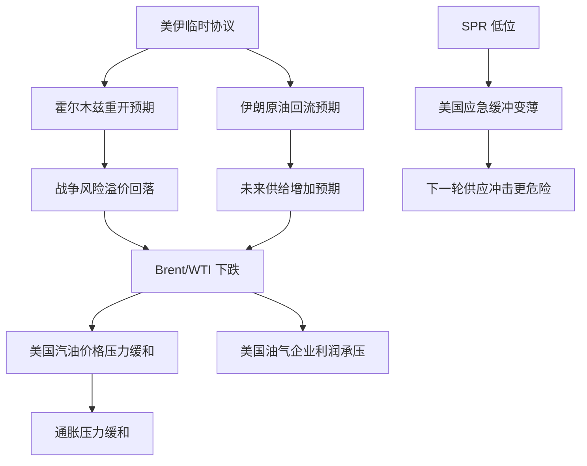

# 石油价格、特朗普和谈动机与美国能源安全（截至 2026-06-17）

这份文档把前一份总览中的油价分析拆开，重点回答五个问题：

1. 当前石油价格主要受哪些因素影响。
2. 为什么 2026-06-15 和 2026-06-16 两天油价大跌。
3. 为什么特朗普会接受与伊朗的临时和谈安排。
4. 油价涨跌分别如何影响美国。
5. 美国战略石油储备（SPR）处于低位意味着什么。

## 1. 当前价格位置与直接触发器

截至 **2026-06-17**，Reuters 报道显示：

- Brent 原油约 **79.26 美元/桶**
- WTI 原油约 **76.29 美元/桶**
- 两者都处于大约三个月低位附近

核心背景不是需求瞬间崩塌，而是市场对“中东断供”的极端担忧显著缓解。当前交易的中心变量已经从“霍尔木兹会不会长期关闭”，转成“恢复通航后，伊朗和海湾出口多快回归”。 

## 2. 影响当前油价的五条主线

### 2.1 海峡通航

霍尔木兹海峡是全球最关键的石油通道之一。只要市场担心关闭或受限，油价里就会被加入很厚的地缘风险溢价。一旦出现“通航将恢复”的可信信号，这一溢价会很快被挤掉。

### 2.2 伊朗原油是否回流

这轮价格变化的第二个核心变量，是伊朗石油能否重新进入国际市场。Reuters 6 月 17 日的报道提到，协议细节开始浮现，其中包括签署后允许伊朗卖油的方向性安排。市场因此把“缺油预期”改写成“增供预期”。

### 2.3 全球供需预期

IEA 在 2026 年 6 月 Oil Market Report 中把 2026 年全球石油需求预测下调了 **70 万桶/日**，并给出一个更偏空的中期图景：2027 年全球供应预计增加 **800 万桶/日**，而需求只增长 **200 万桶/日**。这意味着，哪怕短期库存还偏紧，市场也会更倾向于按“未来供给宽松”来定价。

### 2.4 库存与补库

IEA 同时指出，随着美伊临时协议推进，未来几个月存在“补充已耗尽库存或新建战略储备”的窗口。这个判断很重要，因为它说明短期价格并不一定单边下行：若各国趁低价补库，会形成新的需求托底。

### 2.5 宏观与金融预期

Reuters 报道提到，除地缘因素外，市场还在消化中国需求走弱、全球利率和通胀约束、以及其他冲突缓和预期。这些宏观因素本身就偏向压低风险资产与周期品估值。

## 3. 为什么这两日油价暴跌

如果按 **2026-06-15** 和 **2026-06-16** 两个交易日计算，暴跌的核心逻辑可以概括成一句话：

> 市场在两天内迅速把“战争风险溢价”回吐掉了。

### 3.1 第一天：协议打掉极端风险

6 月 15 日，特朗普表示美国和伊朗已经签署了一份旨在结束战争并重开霍尔木兹海峡的谅解备忘录。当日：

- Brent 收于 **83.17 美元/桶**，下跌 **4.76%**
- WTI 收于 **80.75 美元/桶**，下跌 **4.87%**

这说明市场最先重新定价的是“最坏情景不再是基准情景”。

### 3.2 第二天：市场开始交易“增供”

6 月 16 日，市场不再只是交易“停火”，而是开始交易“恢复油流”和“伊朗重新卖油”。Reuters 报道中，Brent 一度跌到 **79.88 美元/桶**，WTI 跌到 **76.93 美元/桶**，单日跌幅约 **4% 至 4.7%**。

也就是说，第一天跌的是风险溢价，第二天跌的是供给回归预期。

### 3.3 为什么跌得这么快

因为此前市场定价里最贵的部分，不是日常供需，而是尾部风险：

- 霍尔木兹长期关闭
- 海湾油流持续中断
- 美国继续消耗 SPR 维持市场稳定
- 全球通胀和航运冲击继续发酵

一旦这些尾部风险被临时协议明显削弱，价格就会出现跳跃式回落。

## 4. 为什么特朗普会同意伊朗和谈

没有公开文件把动机完整展开，但从公开结果与政策约束倒推，特朗普接受临时和谈，至少符合四个现实目标。

### 4.1 压低汽油价格与通胀压力

EIA 的 Gasoline and Diesel Fuel Update 显示，**2026-06-15** 当周美国普通汽油均价为 **4.052 美元/加仑**，虽较前一周回落，但仍不低。EIA 也明确指出，零售汽油价格最大的组成部分是原油成本，汽油价格受原油和库存变化显著影响。

对美国政府来说，高油价最直观的政治后果就是：

- 居民加油更贵
- 物流成本上升
- 通胀数据承压
- 消费者情绪转弱

### 4.2 减少战争对宏观的二次冲击

Dallas Fed 2026 年研究指出，在一个“当前短缺规模”的可行情景下，2026 年第四季度相对上一年第四季度的 headline PCE inflation 会被抬高 **0.6 个百分点**，core PCE inflation 也会增加 **0.2 个百分点**。这意味着，继续打下去的成本不仅是军事成本，还包括宏观管理成本。

### 4.3 避免继续压榨战略石油储备

SPR 不是无限的。继续维持高对抗状态，就意味着政府需要保留更强的市场干预准备，而当储备已经很低时，这种策略的边际成本会明显上升。

### 4.4 先把最难的问题后置

当前临时安排的本质，是把“停火、通航、卖油”与“核问题终局解决”拆开。对于美国政府来说，这样做的现实价值很高：

- 先拿到市场稳定
- 先降低能源与通胀压力
- 再把核核查、制裁与浓缩权这些最难问题放进下一轮谈判

## 5. 油价涨跌对美国的不同影响

美国不是一个单纯的石油进口国，也不是一个只靠油价上涨获利的资源型经济体。它同时是：

- 大型能源生产国
- 大型成品油消费市场
- 重要的石油与成品油贸易国

EIA 数据显示，美国在 2023 年仍是**原油净进口国**，但从总石油口径看已是**净出口国**。这意味着美国会同时受到“消费端”和“生产端”两种方向的影响。

### 5.1 油价上涨时

受益方：

- 上游油气企业
- 页岩油主产区
- 部分出口链条

受损方：

- 居民消费
- 航空、物流、农业、制造业
- 货运和化工等高能耗行业
- 通胀与利率环境

短期宏观上，通常是坏处更先被感知，因为美国居民对汽油价格变化非常敏感。

### 5.2 油价下跌时

受益方：

- 居民加油支出
- 运输、零售、航旅
- 宏观通胀预期

受损方：

- 油气公司利润
- 页岩投资回报
- 产油州税收和就业预期

所以对美国来说，油价不是“越低越好”或“越高越好”，而是存在一个政治和经济上都更舒服的中间区间。

## 6. 美国战略石油储备低位意味着什么

EIA Weekly Petroleum Status Report 显示，截至 **2026-06-05** 当周，美国 SPR 为 **349.2 million barrels**；Reuters 6 月 15 日援引 DOE 数据称，SPR 已降到 **340.3 million barrels**，为 **1983 年以来最低水平**。这说明美国虽然没有“见底”，但缓冲垫已经很薄。

### 6.1 应急能力下降

如果霍尔木兹再次受阻、飓风冲击美国湾岸，或全球同时发生新的供应事故，美国可投放的战略库存比以往少得多。

### 6.2 政策选项减少

SPR 越低，政府越难把“释放储备”当作常规稳价工具。下一次冲击来临时，可用政策会更依赖外交、制裁松紧、国内产量和需求管理。

### 6.3 风险定价更敏感

市场知道美国安全垫变薄后，下一次中东、俄乌或飓风消息出现时，油价更容易重新出现大幅上冲。

### 6.4 后续补库会限制油价下行

如果局势稳定，美国和其他消费国未来反而可能趁低价补库。这种补库行为本身会形成额外需求，进而限制油价继续单边下跌。

## 7. 三条结论

### 7.1 价格层面

这轮暴跌首先是地缘风险溢价的消退，其次才是对伊朗增供和中期供给宽松的重新定价。

### 7.2 政策层面

特朗普愿意接受临时和谈，最现实的解释不是“突然全面和解”，而是继续打下去会同时伤到油价、汽油、通胀和战略储备安全垫。

### 7.3 美国层面

油价下跌对美国消费者和宏观稳定总体更有利，但 SPR 已经很低这一现实决定了：美国现在更承受不起下一次真正的供应中断。

## 8. 影响链图

## 9. 参考来源

- Reuters, 2026-06-17: `oil-prices-steady-as-investors-weigh-peace-deal-iea-glut-forecasts`
- IEA, Oil Market Report, 2026-06-17
- EIA, Gasoline and Diesel Fuel Update, release date 2026-06-16
- EIA, Weekly Petroleum Status Report, week ending 2026-06-05
- Dallas Fed, `Implications of the Iran war for U.S. inflation`, 2026-04-17
- EIA, `Factors affecting gasoline prices`
- EIA, `How much petroleum does the United States import and export each year?`
